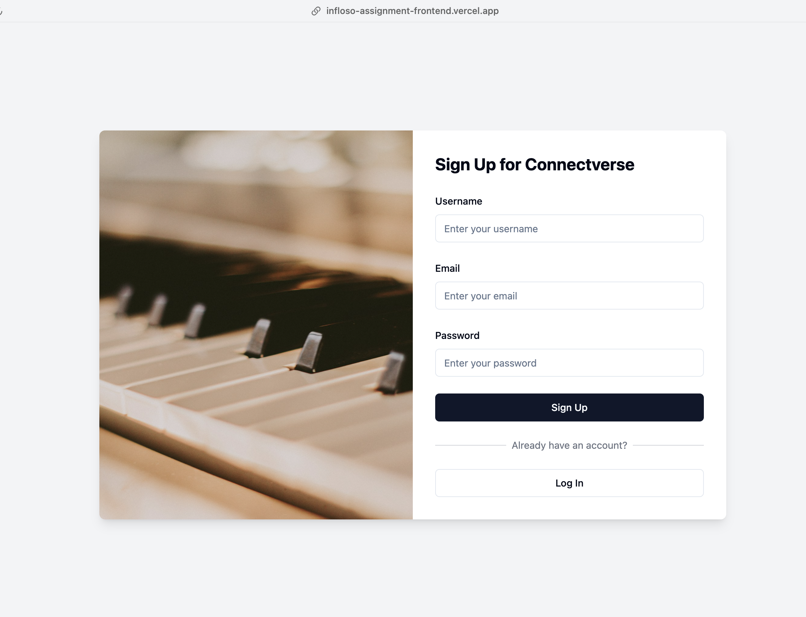

# Infloso Assignment
## Build Login and Signup App with React.js, Node.js and JWT

This assignment demonstrates proficiency in developing secure and efficient applications using ReactJS, Node.js, and JWT authentication. It includes a robust frontend and backend for a web application's login and signup functionality, adhering to best practices.

## Project Description

The project consists of two parts:

1. **Connectverse API**: A Node.js API that handles user registration and authentication for a fictional social media platform called "Connectverse".
2. **MelodyVerse Frontend**: Login and signup screens for a fictional music streaming service called "MelodyVerse".

## Connectverse API

### Description

Connectverse API is a Node.js-based backend for a fictional social media platform. It provides user authentication, post creation, and commenting functionalities using Express.js and Prisma ORM with PostgreSQL.

**LIVE AT:** [https://infloso-assignment.vercel.app](https://infloso-assignment.vercel.app)

### Backend Demo

Click on the image above to view the backend demo video.

## MelodyVerse - Music Streaming Service Frontend

### Overview

MelodyVerse is a fictional music streaming service. This project implements the login and signup screens for the service, focusing on creating visually appealing, user-friendly interfaces that function flawlessly across various devices (desktop, tablet, mobile).

**Live Demo:** [https://infloso-assignment-frontend.vercel.app](https://infloso-assignment-frontend.vercel.app)

### Frontend Demo

Click on the image above to view the frontend demo video.

## Technologies Used

- Frontend:
  - React.js
  - Vite
  - TypeScript
  - SWC (Speedy Web Compiler)
  - [Add any additional libraries or frameworks used]

- Backend:
  - Node.js
  - Express.js
  - Prisma ORM
  - PostgreSQL
  - JSON Web Tokens (JWT)

## Features

- User registration and authentication
- Secure password handling
- JWT-based session management
- Responsive design for desktop, tablet, and mobile devices
- User-friendly login and signup interfaces

## Installation and Setup

[Add instructions for setting up and running both the frontend and backend projects]

## API Documentation

[Add a brief overview of the API endpoints or link to detailed API documentation]

## Contributing

Contributions are welcome! Please feel free to submit a Pull Request.

## License

This project is licensed under the [MIT License](LICENSE).